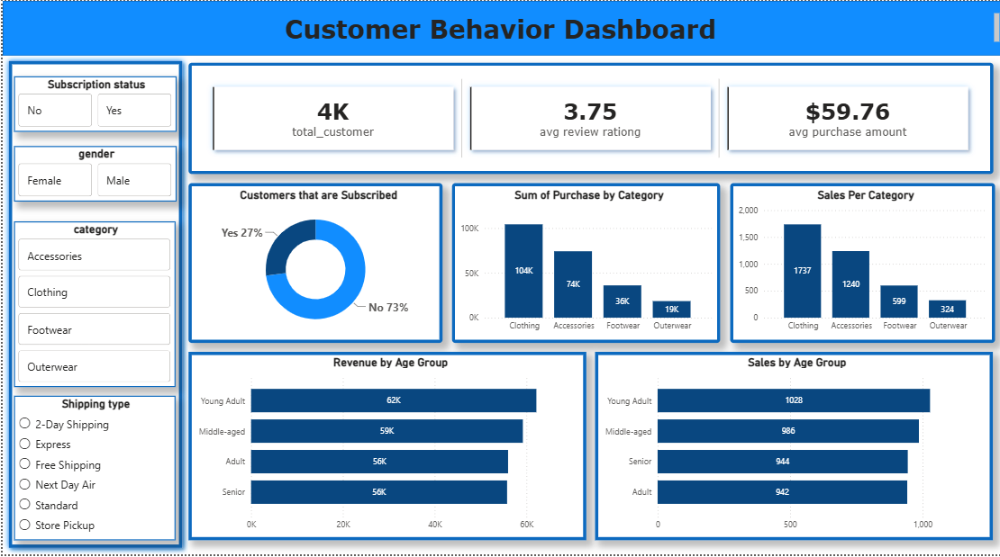

# 🛒 Customer Shopping Behavior Analysis

An end-to-end Data Analytics project that analyzes customer shopping behavior using **Python**, **MySQL**, and **Power BI** to uncover customer purchasing patterns, product trends, subscription insights, and business opportunities.

---

# 📌 Project Overview

This project analyzes shopping transactions from **3,900 customers** to help businesses understand customer behavior and improve decision-making through data.

The project covers the complete analytics lifecycle:

- Data Cleaning using Python
- Data Storage using MySQL
- Business Analysis using SQL
- Interactive Dashboard using Power BI
- Business Recommendations based on insights

---

# 📊 Dashboard



> Replace `dashboard.png` with the screenshot uploaded in this repository.

---

# 🚀 Tech Stack

- **Python**
  - Pandas
  - NumPy
  - Matplotlib
- **MySQL**
- **Power BI**
- SQL
- Git & GitHub

---

# 📂 Dataset Information

- **Total Records:** 3,900
- **Total Columns:** 18

### Dataset includes

- Customer Information
- Product Category
- Purchase Amount
- Gender
- Age
- Review Rating
- Subscription Status
- Shipping Type
- Discounts
- Previous Purchases
- Purchase Frequency
- Seasons
- Product Details

---

# 🧹 Data Cleaning & Preprocessing

The raw dataset was cleaned using Python before importing into MySQL.

### Cleaning Steps

✔ Checked missing values

✔ Filled missing Review Ratings using **Category-wise Median**

✔ Renamed columns using **snake_case**

✔ Created new features:

- Age Group
- Purchase Frequency

✔ Removed redundant columns

✔ Standardized data types

✔ Verified data consistency before loading into MySQL

---

# 🗄 Database

Unlike the original report, this project uses **MySQL** as the relational database.

The cleaned dataset was imported into MySQL where all analytical queries were executed.

---

# 📈 SQL Business Analysis

Several business questions were answered using SQL.

## Revenue Analysis

- Revenue by Gender
- Revenue by Age Group
- Revenue by Subscription Status

---

## Customer Behaviour

- Subscriber vs Non-Subscriber Analysis
- Repeat Buyers Analysis
- Customer Segmentation
- High Spending Customers

---

## Product Analysis

- Top Rated Products
- Most Purchased Products
- Top 3 Products within each Category
- Discount Dependent Products

---

## Sales Analysis

- Sales by Category
- Purchase Amount by Category
- Shipping Type Comparison

---

# 📊 Power BI Dashboard

The dashboard provides interactive insights with slicers for:

- Subscription Status
- Gender
- Category
- Shipping Type

### KPI Cards

- Total Customers
- Average Review Rating
- Average Purchase Amount

### Visualizations

- Subscription Distribution
- Revenue by Age Group
- Sales by Age Group
- Purchase by Category
- Sales by Category

---

# 🔍 Key Insights

### 👥 Customer Insights

- Around **73%** customers are non-subscribers.
- Young Adults generate the highest revenue.
- Average purchase amount is approximately **$59.76**.
- Average customer review rating is **3.75**.

---

### 🛍 Product Insights

- Clothing contributes the highest revenue.
- Clothing also records the highest number of sales.
- Some products are heavily dependent on discounts for purchases.

---

### 📦 Shipping Insights

Express shipping customers spend slightly more on average than Standard shipping customers.

---

### Loyalty Insights

Most customers belong to the Loyal customer segment, indicating strong repeat purchasing behavior.

---

# ⚡ Performance Improvements

Several optimizations were applied during the project to improve performance and maintainability.

### Data Processing

- Removed unnecessary columns before database import
- Reduced duplicate computations
- Performed feature engineering in Python instead of SQL
- Used category-wise aggregation for efficient missing value handling

### SQL Optimization

- Used Common Table Expressions (CTEs) for readable queries
- Applied Aggregate Functions efficiently
- Used Window Functions (ROW_NUMBER, RANK) where applicable
- Reduced nested subqueries
- Used GROUP BY only when required
- Filtered data early using WHERE clauses to minimize scanned rows

### Dashboard Optimization

- Created summarized visuals instead of displaying raw tables
- Used slicers for dynamic filtering
- Limited unnecessary visuals to improve dashboard responsiveness
- Organized dashboard into KPI, Sales, Customer, and Revenue sections for better user experience

---

# 💼 Business Recommendations

✔ Increase subscription benefits to improve customer retention.

✔ Target Young Adults with personalized marketing campaigns.

✔ Promote top-rated products to improve conversions.

✔ Optimize discount strategies for products with excessive discount dependency.

✔ Reward loyal customers through loyalty programs.

✔ Increase focus on high-performing categories like Clothing.

---

# 📁 Project Structure

```
Customer-Shopping-Behavior-Analysis/
│
├── dataset/
│   └── customer_shopping.csv
│
├── python/
│   └── data_cleaning.ipynb
│
├── sql/
│   └── analysis_queries.sql
│
├── powerbi/
│   └── Customer_Behavior_Dashboard.pbix
│
├── dashboard.png
│
├── README.md
│
└── requirements.txt
```

---

# 📚 Skills Demonstrated

- Data Cleaning
- Exploratory Data Analysis
- Feature Engineering
- SQL Analytics
- MySQL
- Window Functions
- CTEs
- Power BI
- Data Visualization
- Business Intelligence
- Dashboard Design

---

# 🎯 Future Improvements

- Predict customer churn using Machine Learning
- Customer Lifetime Value (CLV) prediction
- Product Recommendation System
- Sales Forecasting
- Interactive Web Dashboard using Streamlit

---

# 👨‍💻 Author

**Samyak Ranjan Panda**

Data Analytics | SQL | Python | Power BI

LinkedIn: *https://www.linkedin.com/in/samyak-ranjan-panda-ba547b29a/*
---

⭐ If you found this project useful, consider giving it a **Star**.
